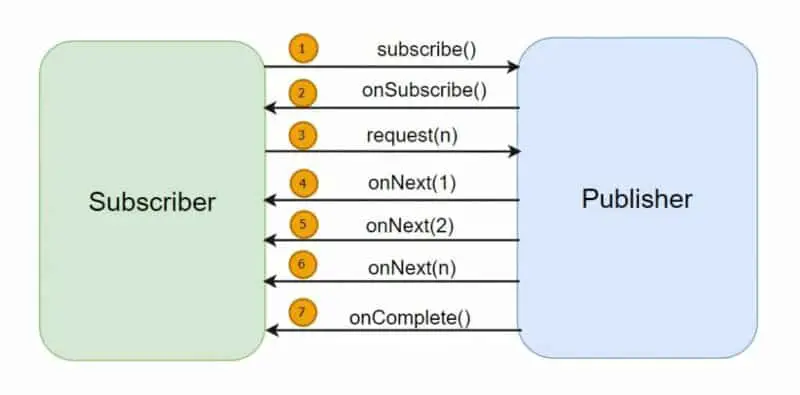

# 📘 Comprehensive Notes: Processes, Threads, and Java Threading Model

## 1. Process in Operating Systems

* **Definition**:
  A **process** is an instance of a computer program in execution.

    * It includes code, data, and OS-allocated resources (memory, sockets, file handles, etc.).
    * Each process has its **own isolated memory space**.

* **Lifecycle and Characteristics**:

    * A process is **heavyweight** (expensive to create/destroy).
    * Creating a process involves allocating memory, initializing data structures, and managing resources.
    * Just because a process exists does not mean it’s actively executing on the CPU. Execution depends on OS scheduling.

* **Example**:
  Running a Java application packaged as a JAR:

  ```bash
  java -jar myapp.jar
  ```

    * This command loads the application into memory.
    * The OS creates a **process** for it with its own memory and resources.

---

## 2. Threads

* **Definition**:
  A **thread** is the smallest unit of execution within a process.

    * A process must have **at least one thread**.
    * Multiple threads within a process share the same memory space.

* **Process vs Thread**:

    * **Process** → Unit of resource allocation.
    * **Thread** → Unit of execution.

* **Visualization**:

    * One process can contain many threads.
    * Threads share **heap memory** but each thread has its **own stack memory**.

---

## 3. CPU, Scheduler, and Context Switching

* **CPU Execution**:

    * A thread must be scheduled on the CPU to run.
    * The **OS scheduler** decides which thread runs, and for how long (time-slicing).

* **Single Processor Case**:

    * Multiple threads are executed by rapidly switching between them → *time-sharing*.
    * The CPU executes only one thread at a time, but context switches make it appear concurrent.

* **Multiple Processors / Multi-Core CPUs**:

    * Each core can execute one thread at a time.
    * With 4 cores, 4 threads can run in parallel.

* **Context Switching**:

    * When the scheduler switches from one thread to another, it must save the current thread’s state (program counter, registers, stack pointer).
    * Later, it resumes the thread from that saved state.
    * Context switches are **expensive operations**.

---

## 4. Memory in Threads

* **Heap Memory**:

    * Shared among all threads of a process.
    * Stores dynamically created objects (e.g., `ArrayList`, `HashMap`).

* **Stack Memory**:

    * Each thread has its own stack.
    * Stores local variables, method calls, and object references.
    * Size is fixed when the thread is created.
    * In Java, default stack size is \~1 MB per thread (OS-dependent; e.g., 2 MB on macOS).

* **Implication**:

    * Even idle threads consume stack memory.
    * Large number of threads = high memory overhead.

---

## 5. Java Threads

* **Background**:

    * Introduced 25 years ago.
    * In Java, a thread is essentially a **wrapper around an OS thread**.
    * **One Java thread ↔ One OS thread**.

* **Execution**:

    * Java methods are executed by threads.
    * When the OS switches between Java threads, it must store their stack and state.

* **Example**:

  ```java
  class MyTask extends Thread {
      public void run() {
          System.out.println("Thread running: " + Thread.currentThread().getName());
      }
  }

  public class ThreadExample {
      public static void main(String[] args) {
          MyTask t1 = new MyTask();
          t1.start(); // creates a new thread
      }
  }
  ```

---

## 6. Threads vs System Resources

* **Threads are expensive** because:

    * Each thread consumes memory (stack).
    * Each context switch consumes CPU cycles.

* **Modern Systems**:

    * Microservices often perform many **network calls**.
    * Network I/O is slow → threads remain **idle**, wasting CPU capacity.

* **Naïve Solution**: Create more threads to keep CPU busy.

    * Problem: leads to excessive memory consumption and overhead.
    * Threads are not scalable when thousands of concurrent tasks are required.

---

## 7. Key Takeaways

1. **Process**: Heavyweight, isolated memory, contains threads.
2. **Thread**: Lightweight execution unit within a process.
3. **Scheduler**: Decides which thread gets CPU time.
4. **Context Switching**: Allows multitasking, but is costly.
5. **Java Threads**: One-to-one mapping with OS threads.
6. **Memory Model**: Shared heap, private stacks.
7. **Thread Limitations**: Expensive resources → too many threads reduce efficiency.

---
# I/O Communication Models (Blocking, Asynchronous, Non-Blocking, Reactive)

## 1. Introduction

* In software systems, **I/O (Input/Output)** refers to **inbound (requests, inputs)** and **outbound (responses, outputs)** interactions between applications, services, or databases.
* How the **calling thread** behaves while waiting for I/O responses defines different communication models.

---

## 2. Synchronous Blocking Communication

* **Real-Life Analogy**:

  * You call your insurance company.
  * The line puts you on hold until a representative is available.
  * You cannot do anything else while waiting.

* **Technical Explanation**:

  * The thread sends a request and waits until the response comes back.
  * The thread is **blocked** during the wait (sits idle, cannot do other work).

* **Characteristics**:

  * **Simple to implement**.
  * **Inefficient** use of system resources when calls take long.
  * Common in traditional applications.

---

## 3. Asynchronous Communication

* **Real-Life Analogy**:

  * Instead of you waiting on hold, you ask your friend to call the insurance company for you.
  * You can continue your own work.
  * However, your friend is still blocked while waiting for the response.

* **Technical Explanation**:

  * A thread delegates the task to another thread (from a thread pool).
  * From the caller’s perspective → **not blocked**.
  * From the worker’s perspective → still **blocked**.

* **Characteristics**:

  * Improves efficiency for the caller.
  * Still consumes resources because some thread is blocked.
  * Often implemented using **thread pools** in Java.

---

## 4. Non-Blocking Communication

* **Real-Life Analogy**:

  * You call the insurance company.
  * Instead of putting you on hold, they ask for your phone number and promise to call you back when a representative is free.
  * You are **free to do other work**. Later, you receive a notification (call back).

* **Technical Explanation**:

  * A request is sent, but the thread is **not blocked**.
  * The OS or runtime notifies the application when the response is ready.
  * The same thread can handle multiple requests without waiting idly.

* **Characteristics**:

  * Efficient CPU utilization.
  * Requires **event-driven programming model**.
  * Examples in Java: **NIO (New I/O), CompletableFuture callbacks, Netty framework**.

---

## 5. Asynchronous + Non-Blocking Communication

* **Real-Life Analogy**:

  * You give your friend’s number to the insurance company instead of your own.
  * Neither you nor your friend is blocked.
  * When the insurance company is ready, they call your friend directly.

* **Technical Explanation**:

  * A thread sends a request and is immediately free.
  * When the response is ready, the OS notifies a **different thread** (not the caller).
  * This allows work to be distributed across multiple CPUs/cores.

* **Characteristics**:

  * Most **complex** model.
  * Combines scalability of non-blocking with flexibility of async execution.
  * Basis for **reactive programming** frameworks (e.g., **Project Reactor, RxJava, Vert.x**).

---

## 6. Complexity Scale

* On a scale of **1 (simple) → 4 (complex)**:

  1. Synchronous Blocking
  2. Asynchronous (delegation with blocking worker)
  3. Non-Blocking
  4. Non-Blocking + Asynchronous

---

## 7. Reactive Programming

* **Definition**:
  A programming paradigm that simplifies **non-blocking asynchronous I/O** by providing an event-driven model.
* **Key Principles**:

  * Instead of managing callbacks manually, developers compose streams of asynchronous events.
  * Reactive systems are **responsive, resilient, elastic, and message-driven**.
* **Examples in Java**:

  * Project Reactor (used in **Spring WebFlux**)
  * RxJava
  * Akka Streams

---

# Reactive Streams & Reactive Programming

## 1. The Motivation

* Modern applications are increasingly **complex and connected**:

  * Smartphones, smartwatches, IoT devices are all online.
  * Users demand **real-time updates** (notifications, live feeds, continuous data).
* **Problem with request-response model**:

  * Clients cannot keep polling servers every second (*“Do you have an update?”*).
  * Inefficient: wastes network bandwidth and CPU cycles.
* **Needed solution**:

  * Server should **push updates** when available (streaming).
  * Clients may also need to **stream events back** (e.g., browsing behavior, telemetry data).
  * Complex **interaction patterns** require more than request-response.

---

## 2. The Birth of Reactive Streams

* Around **2014**, major tech companies (Netflix, Twitter, Lightbend, etc.) collaborated.
* They introduced the **Reactive Streams Specification**:

  * A standard for **asynchronous stream processing** with **non-blocking backpressure**.
* **Key principles (keywords)**:

  1. **Asynchronous** → work happens without blocking threads.
  2. **Non-blocking** → resources are not locked idly while waiting for I/O.
  3. **Backpressure** → mechanism for controlling data flow between producer and consumer.
  4. **Stream processing** → not just single messages, but continuous flows of data.

---

## 3. Analogy: Programming Paradigm Evolution

* **Procedural Programming (C)**:

  * Unit of reusability = **function**.
  * Powerful but not enough for large, complex applications.

* **Object-Oriented Programming (Java, C++)**:

  * Introduced **abstraction, encapsulation, inheritance, polymorphism**.
  * Unit of reusability = **class**.
  * Provided built-in **data structures** (List, Set, Map) that procedural C lacked.

* **Reactive Programming**:

  * A **new programming paradigm** for modern I/O patterns.
  * Designed to handle **asynchronous, non-blocking, backpressured streams**.
  * Complements OOP: where OOP provides tools for data structures, **Reactive provides tools for I/O communication**.
  * Unit of reusability = **stream of events** (rather than functions or objects).

---

## 4. What is Reactive Programming?

* **Definition**:
  A programming paradigm designed to **process streams of messages** in an **asynchronous**, **non-blocking** way while handling **backpressure**.

* **Observer Pattern Foundation**:

  * Based on the classic **Observer Design Pattern**:

    * *Publisher (Observable)* emits data.
    * *Subscriber (Observer)* consumes data.
  * Reactive frameworks extend this model with backpressure & stream operators.

* **Learning Curve**:

  * At first, may seem complex (just like OOP concepts like inheritance/polymorphism were hard initially).
  * With practice, it becomes intuitive and powerful.

---

## 5. Why Reactive Programming?

* **Traditional OOP + Threads**:

  * Great for request-response but lack built-in tools for continuous I/O streams.
* **Reactive Programming**:

  * Provides the right **abstractions and libraries** to manage complex I/O flows.
  * Simplifies building apps with **real-time updates, streaming requests/responses, and bidirectional communication**.
  * Examples:

    * Live feeds (Twitter timeline, Netflix recommendations).
    * Notifications pushed to mobile devices.
    * Continuous telemetry from wearables or IoT sensors.

---

## 6. Key Takeaways

1. **Reactive Streams Specification (2014)**: defines how to process asynchronous data streams with non-blocking backpressure.
2. **Reactive Programming**: a new paradigm for modern I/O, just as OOP was a paradigm shift from procedural programming.
3. **Core concepts**: asynchronous, non-blocking, backpressure, stream processing.
4. **Complements OOP**: not a replacement, but an extension focused on I/O handling.
5. **Observer Pattern** at its core, enhanced with stream operators and flow control.

---

# 📘 How Reactive Programming Works

## 1. Foundation: The Observer Pattern

* **Definition**:

  * A design pattern where an **observer** subscribes to a **subject** (or publisher) to be notified of updates/events.
* **Example 1 (Twitter/X)**:

  * A celebrity (Publisher) posts tweets.
  * Followers (Subscribers) automatically receive updates.
  * Followers can react (like, retweet, comment).
* **Key idea**: *Observe and react to changes/events.*

---

## 2. Business Logic Example (Excel Analogy)

* Suppose we need to:

  1. Call a remote service (returns a string).
  2. Compute its length.
  3. Multiply the length by 2.
  4. Add 1 to the result.

* **Excel Sheet Analogy**:

  * Remote response fills **Cell F5** asynchronously.
  * Another cell observes F5 → computes `LEN(F5)`.
  * Next cell observes that → multiplies by 2.
  * Next cell observes that → adds 1.

* As soon as data arrives (`"Hi"`, `"Hello"`, etc.), formulas react instantly and update results.

* **Lesson**:

  * Reactive Programming chains callbacks/transformations together.
  * Data arrives asynchronously, and the system *reacts* automatically.

---

## 3. Reactive Streams Specification

* Introduced (2014) to **standardize reactive programming** in Java ecosystems.

* Defines **4 core interfaces**:

  1. **Publisher<T>** → produces data/events.

    * Example: Twitter celebrity posting tweets.
  2. **Subscriber<T>** → consumes data.

    * Example: Followers who read tweets.
    * Can:

      * `request(n)` → ask for more events (backpressure).
      * `cancel()` → unsubscribe/unfollow.
  3. **Subscription** → represents the relationship between publisher and subscriber.
  4. **Processor\<T, R>** → acts as both publisher *and* subscriber.

    * Example: You follow a celebrity (subscriber), and your followers watch your retweets (publisher).

* **Pipeline Structure**:

  ```
  Publisher → [Processor → Processor …] → Subscriber
  ```

  * Publishers emit events.
  * Optional processors transform/relay events.
  * Subscribers consume results.

---

## 4. Specification vs Implementation

* **Specification** = defines rules & contracts (interfaces).

  * Example: **JPA (Java Persistence API)** is only a spec.
  * Implementations = Hibernate, EclipseLink, etc.

* **Reactive Streams** is only a spec.

* Implementations include:

  * **RxJava**
  * **Project Reactor (Spring)** ✅ (focus of this course)
  * **Akka Streams**
  * **Mutiny**

---

## 5. Ecosystem Support

* Reactive programming is widely supported across the stack:

  * **Databases**: R2DBC (Reactive Relational DB driver for Postgres, MySQL, etc.)
  * **Messaging**: Kafka, RabbitMQ
  * **NoSQL**: MongoDB, Redis, Elasticsearch
  * **Networking**: WebSockets
* **Spring ecosystem** provides strong support via **Spring WebFlux** + Reactor.

---

## 6. Key Takeaways

1. Reactive programming is built on the **Observer pattern**: *publish → subscribe → react*.
2. **Reactive Streams Specification** defines the standard: `Publisher`, `Subscriber`, `Subscription`, `Processor`.
3. Specification ≠ library. We rely on **implementations** like **Reactor, RxJava, Akka Streams**.
4. Reactive pipelines form a chain of publishers, processors, and subscribers.
5. Strong ecosystem support (databases, messaging, networking) makes it practical in modern distributed systems.

---

Nice — this is the core of Reactive Streams semantics. I’ve rewritten and organised your lecture into a clear, compact reference you (or your students) can re-watch and use as a checklist. Read it twice (or ten times 😉) — it’s the kind of stuff you’ll want memorised.

# Reactive Streams — basic rules & signal contract (refined)

## Quick overview

Reactive Streams defines a small set of roles and a strict *signal contract* between them so asynchronous streaming can work reliably with **backpressure**:

* **Publisher** — produces items (a source).
* **Subscriber** — consumes items (a sink).
* **Subscription** — a control handle connecting a Subscriber to a Publisher (`request(n)` and `cancel()`).
* **Processor** — both a Subscriber *and* a Publisher (an operator in the pipeline).

These roles interact by exchanging **signals**: `onSubscribe(Subscription)`, `onNext(T)`, `onError(Throwable)`, `onComplete()`.

---

## Step-by-step rules (the contract)

1. **Subscribe**

  * A `Subscriber` registers with a `Publisher` by calling `publisher.subscribe(subscriber)`.
  * The publisher must respond by calling `subscriber.onSubscribe(subscription)` and hand over a `Subscription` instance.
  * `onSubscribe(…)` **must be called before any other signal** for that subscription.

2. **Subscription is the control plane**

  * `Subscription` exposes:

    * `request(long n)` — ask for `n` items (demand).
    * `cancel()` — stop the flow / unsubscribe.
  * The `Subscriber` uses the `Subscription` to control flow (backpressure) and to cancel when it wants no more items.

3. **Demand (request)**

  * `request(n)` expresses how many `onNext` items the Subscriber is ready to accept.
  * `n` **must be positive** ( > 0 ). Calling `request(0)` or negative values is a protocol violation (implementations usually turn that into an error).
  * `request` is cumulative — more calls add to demand. `request(Long.MAX_VALUE)` is commonly treated as “unbounded” demand.

4. **Data delivery via onNext**

  * The Publisher sends items by invoking `subscriber.onNext(item)` **up to the number of requested items** (or fewer).
  * **Important invariant:** The publisher **must not** emit more `onNext` calls than the current outstanding requested demand. Emitting more is a spec violation.
  * `onNext` may be called **zero or more times** depending on demand and availability.

5. **Terminal signals — onComplete / onError**

  * If the Publisher has no more items, it calls `subscriber.onComplete()` — this ends the stream.
  * If an error occurs, it calls `subscriber.onError(Throwable)` — this ends the stream.
  * **Either** `onComplete` **or** `onError` may be signalled — **not both**.
  * Each terminal signal (`onComplete` or `onError`) **is invoked at most once**.
  * **After** a terminal signal, **no further signals** (`onNext`, `onComplete`, `onError`) may be sent and the `Subscription` is effectively dead.

6. **Ordering & serialization**

  * `onSubscribe` must come first.
  * `onNext` calls must be **serialized** (non-overlapping) — a Subscriber must observe a well-ordered sequence of calls; the publisher must not interleave signals in a way that breaks ordering.
  * `onComplete`/`onError` are terminal and follow after `onNext` sequence.

7. **Processor**

  * A `Processor` implements both `Subscriber` and `Publisher`.
  * It subscribes upstream (consumes), transforms/filters/bridges, and then publishes downstream.
  * Processors must respect demand and propagate backpressure correctly.

---

## Short semantics summary (cheat-sheet)

* `Publisher.subscribe(subscriber)` → `subscriber.onSubscribe(subscription)` (once, before anything else).
* Subscriber calls `subscription.request(n)` to ask for items.
* Publisher emits up to `n` via repeated `subscriber.onNext(item)` calls.
* Publisher signals completion with `onComplete()` (or failure with `onError(err)`).
* Terminal (`onComplete`/`onError`) happens at most once — after it, no more signals.
* `request(n)` must be > 0; `onNext` must not exceed outstanding demand.

---

## Terminology / synonyms you’ll see

* Publisher = source / producer / observable / upstream.
* Subscriber = sink / consumer / observer / downstream.
* Processor = operator / transformer / middle-stage.
* Subscription = demand handle / flow-control handle.

---

## Practical modelling examples

* Browser UI (frontend) subscribes to a backend stream: backend = **Publisher**, frontend = **Subscriber**.
* Microservice A depends on B: B is a **Publisher** of responses, A the **Subscriber**.
* Inside a class: `methodA()` produces values → `methodB()` consumes them — same publisher/subscriber modeling applies.
* Chains: `Publisher → Processor → Processor → Subscriber`.

---

## Common pitfalls & best practices

* **Don’t emit more than requested.** This is the most common and serious violation.
* **Don’t block inside `onNext`.** `onNext` should be fast; long blocking will stall signals and hurt throughput. Offload heavy work if needed.
* **Avoid concurrent onNext invocations** to the same Subscriber — keep signals serialized.
* **Handle `request(0)` / negative `request`** — defensive subscribers validate request values; defensive publishers may signal `onError` if invalid.
* **Use `cancel()`** to stop work; cleanup resources on cancel.
* **Propagate backpressure** in intermediate operators (Processors) — they must not break the demand contract.
* **Be explicit about unbounded demand** (`request(Long.MAX_VALUE)`) when you truly want to disable backpressure handling.

---



## Minimal Java signatures (Reactive Streams APIs)

```java
// reactive-streams interfaces (org.reactivestreams)
public interface Publisher<T> {
    void subscribe(Subscriber<? super T> s);
}

public interface Subscriber<T> {
    void onSubscribe(Subscription s);
    void onNext(T t);
    void onError(Throwable t);
    void onComplete();
}

public interface Subscription {
    void request(long n);
    void cancel();
}

public interface Processor<T,R> extends Subscriber<T>, Publisher<R> { }
```

---

## Small ASCII flow (visual)

```
 SubscriberA
     ↑
  onNext/onComplete/onError
     ↑
 [ Processor ] <-- optional chain -- [ Processor ]
     ↑
 onSubscribe(subscription)
     ↑
  Publisher (source)
```

---

## Final tips

* Learn the signal order & demand invariants by heart: **onSubscribe → request → onNext\* → onComplete/onError**.
* Practice with a small custom Publisher/Subscriber to see what happens when you violate rules (e.g., emit more than requested) — many Reactive libraries will throw or log protocol violations which helps debugging.
* When you teach/record: show a concrete example of `request(1)` then publisher calling `onNext` exactly once, then `request(2)`, etc. — incremental demand demonstrates backpressure clearly.

---
